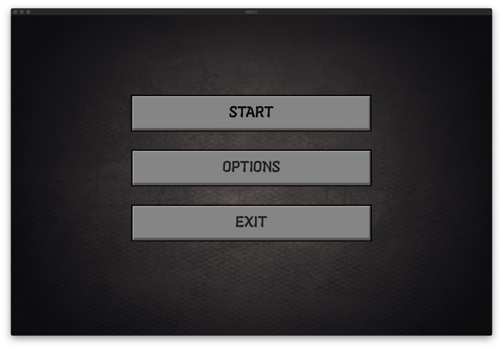
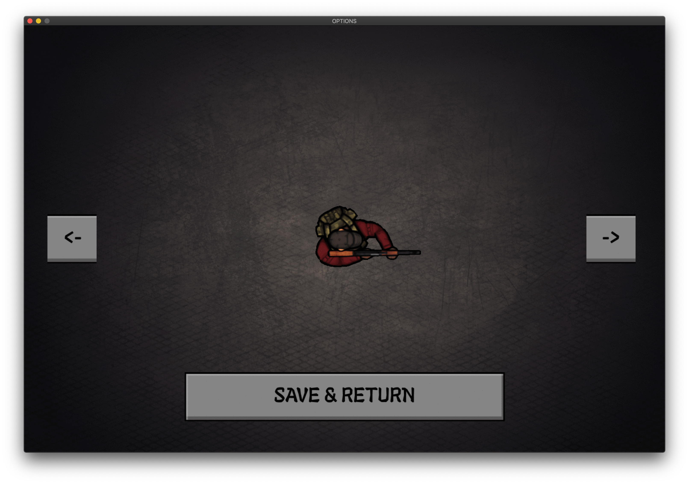
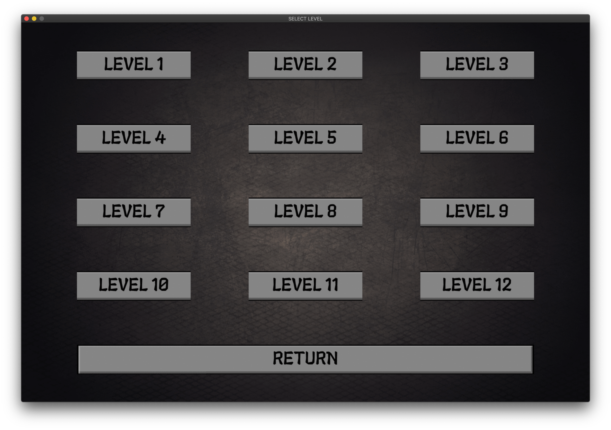
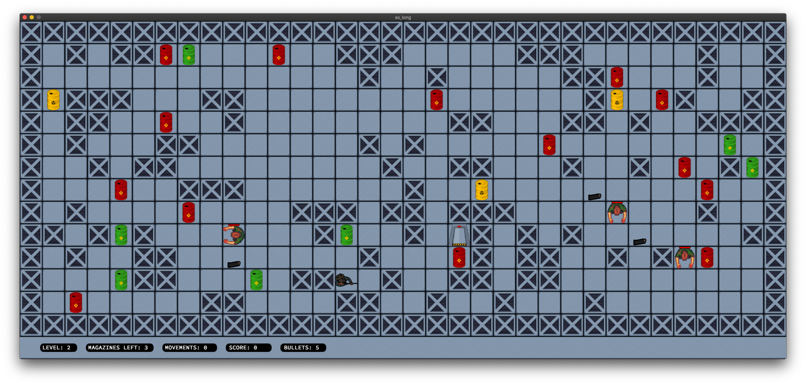
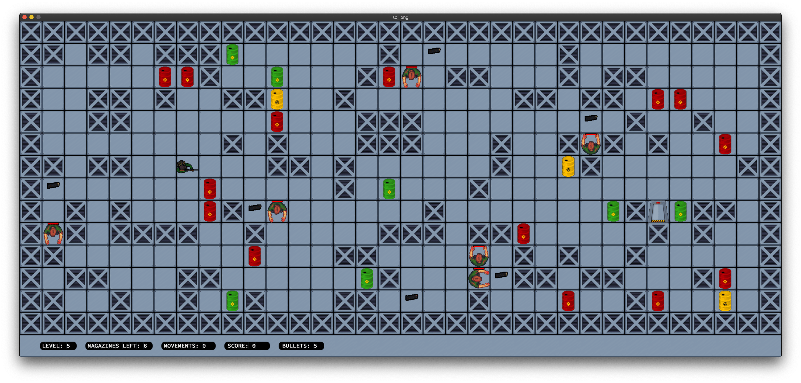
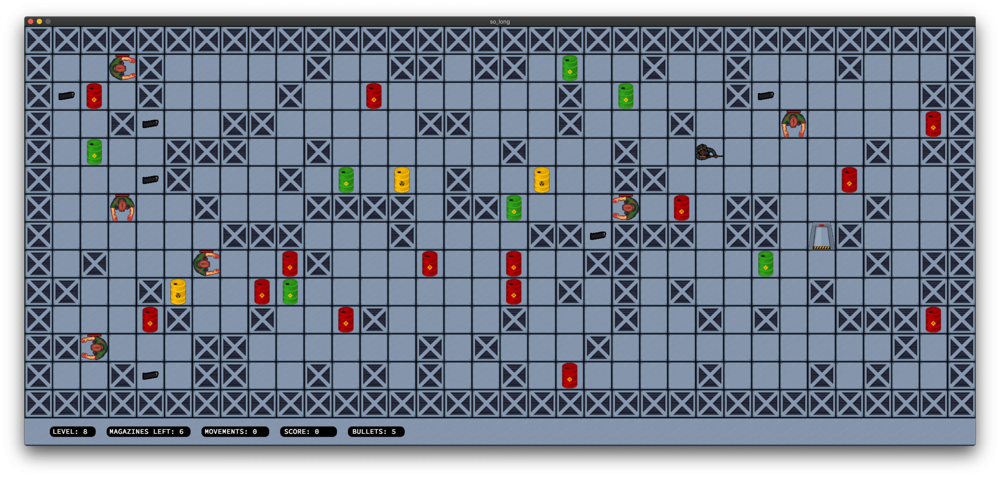

# SoLong

## Description

SoLong is a project that aims to create a simple 2D game using the minilibx library. The game is a simple maze where the player has to collect all the collectibles and reach the exit to win the game.
it also includes a simple enemy that moves randomly and kills the player if it touches him.
### **Note:**
**The project was developed and tested on a macOS system, and it may not work on other operating systems.**

## Installation

1. Clone the repository:
```bash
git clone https://github.com/abouabra/42-SoLong.git
```
2. Change the current working directory:
```bash
cd 42-SoLong
```
3. Compile the project:
```bash
make
```

## Usage
The game can be run using the following command:
```bash
./so_long maps/map.ber
```
The game can be closed by pressing the 'esc' key or by clicking the red cross on the window.

## Map
The map is a simple text file with the following characters:

| Character | Description |
|-----------|-------------|
| 1         | Wall        |
| 0         | Empty space |
| P         | Player      |
| E         | Exit        |
| C         | Collectible|

The map should also be surrounded by walls and should only contain valid characters.

## Controls
The player can move using the WASD keys.

<!-- screenshot location is screenshot/game.png -->
## Screenshots
| Main Menu | Skin Selection | levels menu|
|--------------------------|---------------------| ---------------------|
|  |  |  |


### Level 2


### Level 5


### Level 8



## Final Note
If you have any suggestions or improvements, feel free to open an issue or submit a pull request.
